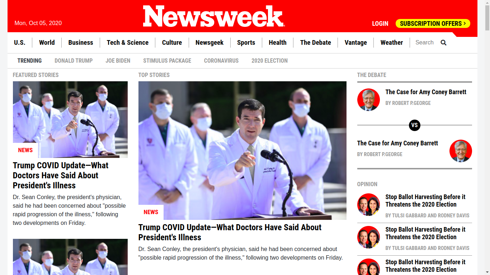

# Newsweek Clone

> Clone of the Newsweek webpage using bootstap

This project is a clone of Newsweek webpage in the HTML/CSS module at Microverse
It consists of building a responsive website using Bootstrap. We cloned The Newsweek home page with a responsive layout that changes at three breakpoints.

We worked on all the requirements given on this project, and it consits of the following components:

- breakpoints at three screen widths:
    - < 768px
    - > 768px and < 992px
    - > 992px
- Header section with fixed layout when scrolling starts
- Featured stories, Top stories and The debate section laid out into a three column bootstrap layout,
  which also collapse into two column layout and one column layout at the 2nd and 1st breakpoints respectively.
- In The Magazine section with four column bootstrap layout, which collapses into a single column layout for <768px breakpoint.
- Editors pick section with four column bootstrap layout, which collapses into two column layout and one column layout at the 2nd and 1st breakpoints    respectively.
- Other news section with three column layout, which collapses into a single layout for <768px breakpoint.
- Subscribe section with two column bootstrap layout, which collapses into a single layout for <768px breakpoint.
- Footer section made with flex layout.
- The page used Flex, Grid and Float layout at differenct sections.

## Built With

- HTML5
- CSS3
- Bootstrap 4
- sass

## Live Demo

[Live Demo Link](https://bini-i.github.io/Newsweek-Clone/index)

## Authors

👤 **Binyam Hailemeskel**

- GitHub: [@bini-i](https://github.com/bini-i)
- Twitter: [@binyamshewa](https://twitter.com/binyamshewa)
- LinkedIn: [LinkedIn](https://www.linkedin.com/in/binyam-hailemeskel-728048151/)

👤 **Rukundo Eric**

- GitHub: [@githubhandle](https://github.com/rukundoeric)
- Twitter: [@twitterhandle](https://twitter.com/rukundoeric005)
- LinkedIn: [LinkedIn](https://www.linkedin.com/in/rukundo-eric-000bba181/)

## 🤝 Contributing

Contributions, issues, and feature requests are welcome!

## Show your support

Give a ⭐️ if you like this project!

## Acknowledgments

- Newsweek

## 📝 License

This project is [MIT](./LICENSE) licensed.
